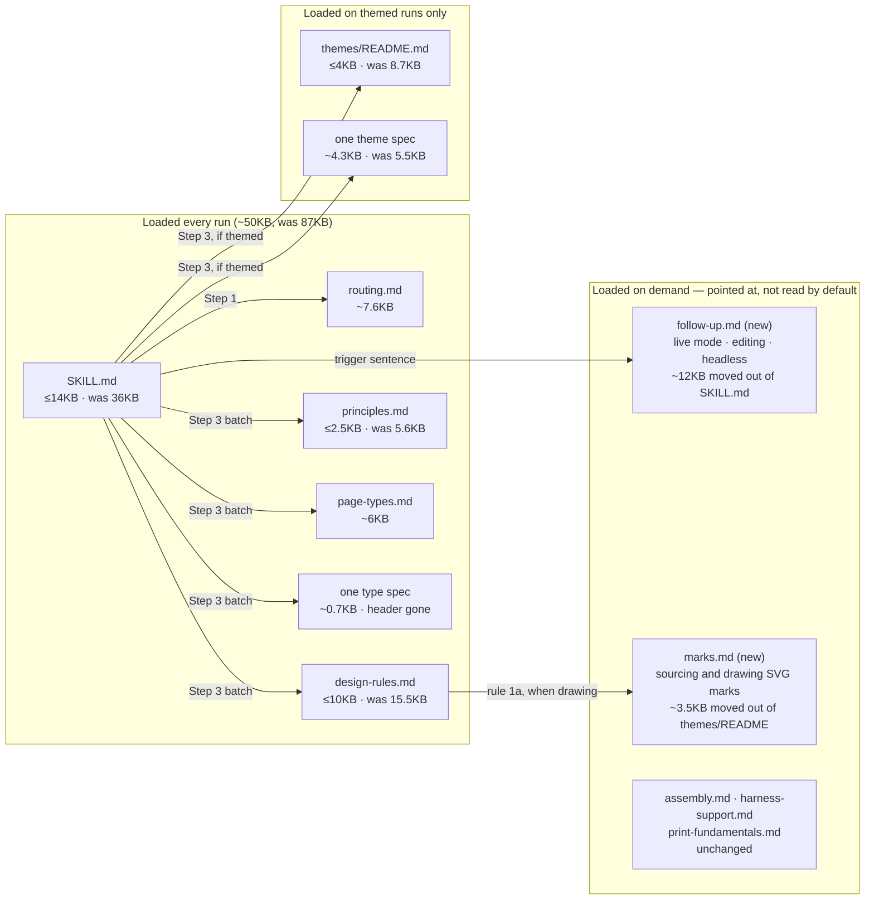

# refactor: Cut the print skill to essentials

## Summary

Cut what the skill loads on every run from ~87KB to ≤50KB by keeping only
what changes the printed page or the model's next action: rules stay, essays
go; anything a check enforces loses its prose; anything serving a turn a
first-generation run never reaches moves behind a pointer. Nothing is
protected — the craft prose included — and one eval batch at the end says
whether quality moved. The server is left alone: its per-check cost is page
load, not launch, and combining checks would save under 2% of wall clock.

---

## Problem Frame

A themed first-generation run loads ~87KB of instruction before it writes a
byte of content, and that instruction rides every one of ~40-50 turns as
cache-read. Measured on the current working tree:

| file | bytes | share | loaded |
|---|---|---|---|
| `SKILL.md` | 36,004 | 41% | every run |
| `references/design-rules.md` | 15,551 | 18% | every run |
| `references/themes/README.md` | 8,752 | 10% | every themed run |
| `references/routing.md` | 8,135 | 9% | every run |
| `references/page-types.md` | 6,635 | 8% | every run |
| `references/principles.md` | 5,581 | 6% | every run |
| one theme spec | ~5,500 | 6% | every themed run |
| one type spec | ~1,130 | 1% | every run |
| **total** | **87,291** | | |

Plus `references/themes/theme-spec-template.md` (6,559) on every ad-hoc themed
run, which the ad-hoc checklist sends the model into.

### Where the bytes go that don't earn their place

**A third of `SKILL.md` serves turns a first generation never reaches.** Live
mode (7,895 bytes across four sections), editing an existing page (2,342),
and headless/pipeline use (2,021) total 12,258 bytes. In 14 eval runs,
`chat-cli` — the live-mode mechanism — ran zero times. The interview (3,738)
is skipped entirely in headless runs. Together that is 16,000 bytes, 44% of
the file, riding every first-generation turn for paths it does not take.

**The same rule is stated in three places.** The fill/overflow rule — stop
short vs stretched, token edits first, one pass — is written out in
`design-rules.md`'s invariants (~1,400 bytes), again in `SKILL.md` Step 3
"Fill the sheet" (~900), and again in Step 6's fill paragraph (~700), with
`principles.md` VII restating the overflow half. One statement, in one place,
pointed at from the others.

**Explanation outnumbers instruction.** The `SKILL.md` preamble spends ~2,400
bytes on how the shell's shadow root isolates chrome from the document — a
mechanism the model never operates. Step 6 spends ~1,400 explaining the
squeeze ladder's percentages and how it persists a `<style>` block; the model
reads the check's output, not its internals. Design rule 1 spends ~1,500 bytes
on why blurred shadows print as mud; the lint catches them regardless. The
Part B pointer, written to replace a 60-line checklist with a short note, has
grown back to 1,800 bytes restating all nine checks the lint already names when
one fires.

**`principles.md` duplicates `design-rules.md`.** Principles I (tokens not
literals), II (hierarchy not decoration), and VI (no fills, print-flat shadows)
restate Part A rules 1 and 2. III, IV, V and VII carry authoring guidance
stated nowhere else.

**Every type spec carries the same 450-byte header** telling the model where
the routing table lives — which it has already read to arrive at the spec. A
median spec is ~1,100 bytes, so the header is 40% of it.

**`themes/README.md` loads a 3,500-byte drawing tutorial on every themed
run.** "Getting a mark that reads" — how to source, trace, and hand-draw a
recognisable SVG mark — applies only when the page draws a pictorial subject.
Most themed pages do not.

### What the trace evidence says about prose

The model ignored `SKILL.md`'s "batch your reads" instruction in 14 of 14
runs until it was replaced by a command block. It launched `server.mjs`
directly 15 times against an explicit prohibition. Instructions that ask for
behaviour are unreliable; mechanisms and terse rules are followed. That is the
lens for every sentence: does this change the printed page, or the model's next
action? If neither, it is a candidate.

### What this is not

This is a context cut, not a turn cut. Removing prose the model does not act
on does not remove turns; it removes tokens from each turn. Expect cache-read
to fall roughly in proportion to instruction bytes (~40% of ~22k instruction
tokens per turn) and turns to be unchanged. The server's wall clock is also
unchanged: a Chromium launch is ~120ms, a full fit check ~1.8s and contrast
~1.7s, so merging the two saves ~8s of a 456s run.

---

## Requirements

**Budget**

R1. Instruction bytes loaded on a themed first-generation run drop from ~87KB
   to ≤50KB, measured as the sum of the files the Step 1 read and the Step 3
   batched read actually load.
R2. `SKILL.md` drops from 36KB to ≤14KB.
R3. Median cache-read tokens per run drop ≥10% against the most recent
   measurement of the same skill arm, with turns within ±2 of that
   measurement — proving the saving came from context, not from behaviour
   change.

**Nothing lost that changes the page**

R4. Every rule in `design-rules.md`'s platform invariants and Part A survives
   as a statement. Shorter is fine; absent is not. Verified by a rule
   inventory diffed before and after.
R5. Every mechanically enforced check — structural verification, the Part B
   lint, fit, contrast — is unchanged. No server code moves in this plan.
R6. Every follow-up path — editing an existing page, live mode, headless use —
   remains reachable: a trigger sentence in `SKILL.md` names the situation and
   the file to read, and that file carries the full procedure.

**Quality**

R7. No more than 2 of 11 cross-arm pairs go to the control (baseline 1 of 11;
   at n=11 the reachable rates are 100%, 90.9% and 81.8%, so this permits one
   additional loss). Physical-rule violations ≤3.

---

## Key Technical Decisions

KTD1. **Cut by loaded-per-turn cost, not by file size.** The 268KB of
   references is not the problem; the ~87KB loaded every run is. A byte in
   `SKILL.md` costs 40-50 times what a byte in `assembly.md` costs.
   Rationale: cache-read is `turns × context`, and only the always-loaded set
   is in the context on every turn.

KTD2. **Nothing is protected.** The design principles and the reasoning behind
   the design rules are cut like everything else and measured at the gate.
   Rationale: the owner's explicit decision. The earlier plan deferred this
   material as "the likeliest source of the quality margin"; that was never
   tested, and this plan tests it.

KTD3. **One statement per rule, in one place.** Where a rule is written in
   several files, it stays in the file that owns it and the others point.
   Rationale: the fill rule alone costs ~3,000 bytes across three statements.

KTD4. **Where a check exists, the prose goes; where none does, the rule stays
   and the essay goes.** Rationale: the lint names the rule when it fires; the
   model needs a rule stated once, not its justification. Explanation of *why*
   a rule exists moves out of the always-loaded path or is deleted.

KTD5. **Follow-up material moves rather than vanishing.** Live mode, in-place
   editing and headless use go to one on-demand reference. `SKILL.md` keeps
   only the sentence that says when to read it. Rationale: these paths are
   real but were used in 0 of 14 first-generation runs; a pointer costs ~400
   bytes, the material costs 12,000.

KTD6. **The server is out of scope.** Rationale: measured. Launch 120ms, fit
   1.8s, contrast 1.7s; merging them saves ~2% of wall clock and zero tokens,
   while risking a component nine reviewers just spent a fix pass on.

KTD7. **One eval batch at the end, not per cut.** Rationale: the owner's
   posture is aggressive; each batch is ~$48 plus gallery time; attribution
   across six units is not worth six batches for a change whose failure mode —
   pages got worse — is visible in one.

---

## High-Level Technical Design

Where each byte lives after the cut, and how often it loads.

**Budget by unit.** Savings are estimates from reading the current files;
the gate measures the outcome, and R1/R2 are the thresholds.

| unit | file(s) | now | target | saving |
|---|---|---|---|---|
| U1 | `SKILL.md` | 36,004 | ≤14,000 | ~22,000 |
| U2 | `design-rules.md` | 15,551 | ≤10,000 | ~5,500 |
| U3 | `principles.md` | 5,581 | ≤2,500 | ~3,000 |
| U4 | `themes/README.md` + template at runtime | 8,752 (+6,559 ad-hoc) | ≤4,000 (+0) | ~4,700 (+6,500 ad-hoc) |
| U5 | type spec header · theme spec sections | ~1,130 · ~5,500 | ~680 · ~4,300 | ~450 · ~1,200 |
| | **always-loaded, themed run** | **87,291** | **≤50,000** | **~37,000** |

---

## Implementation Units

U-IDs continue from the earlier plan in this directory (which reached U10), so
this plan's units start at U11.

### U11. Cut `SKILL.md` to the first-generation path

**Goal:** `SKILL.md` carries what a first-generation run needs and pointers to
everything else. ≤14KB, from 36KB.

**Requirements:** R1, R2, R6

**Dependencies:** none

**Files:**
- `SKILL.md`
- `references/follow-up.md` (new) — live mode, editing an existing page,
  headless/pipeline use, moved substantially intact
- `server/test/skill-doc.test.mjs` (new) — see test scenarios

**Approach:** Four moves, largest first.

*Move the follow-up material out.* "Live mode" and its three subsections,
"Editing an existing page", and "Headless / pipeline use" — 12,258 bytes —
go to `references/follow-up.md` as they are. `SKILL.md` keeps one trigger
sentence per path, placed where the model will be when it needs it: after
Step 8, "If the user asks to change this page, or pastes `/print fix`, read
`references/follow-up.md` first"; in Step 0, "If the output is for an
automated consumer or the user asked for a PDF file, read the headless section
of `references/follow-up.md`." The `/print fix` paste is the one trigger that
must survive verbatim, since it arrives with no other context.

*Compress the interview.* Step 0.5 is 3,738 bytes for two dialogs. Keep the
skip rule (one sentence: no `AskUserQuestion` tool means headless — skip),
the two dialogs' actual questions and defaults as a compact list, and the
binding sentence. Drop the explanations of why each default is a guess and
the harness-capability discussion, which `references/harness-support.md`
already owns. Target ~1,200 bytes.

*Delete explanation the model does not act on.* The preamble's account of the
shell's shadow root, chrome isolation and PDF renderer (~1,800 of its 2,400
bytes). Step 6's description of the squeeze ladder's percentages and persisted
`<style>` block — the model reads the check's output line. Step 5's paragraph
on what the assemble command does internally. Step 7's fallbacks for a missing
Node install, which `harness-support.md` owns. Step 0's rationale for
`--prefix` over `cd`.

*Dedupe against the references.* Step 3's "Fill the sheet" paragraph and
Step 6's fill paragraph restate `design-rules.md`'s invariant; each becomes
one sentence pointing there (KTD3). Step 3's descriptions of what each
reference file contains duplicate those files' own first paragraphs; keep the
command block and cut the descriptions.

What stays whole: the Step 0 `<skill-dir>` rule, the Step 1 routing
instruction, the Step 3 command block and channel table, the Step 5 command,
Step 8's report shape (compressed to its bullets), and every trigger sentence.

**Patterns to follow:** the current Step 4 — four lines saying the lint runs
inside assembly and pointing at `design-rules.md` — is the target density for
every step.

**Test scenarios** (`server/test/skill-doc.test.mjs`, new — the repo has no
prose tests; this unit needs a small harness that reads `SKILL.md` and asserts
facts about it, in the shape of `cli-help.test.mjs`):
- `SKILL.md` is ≤14,000 bytes.
- Every `<skill-dir>` path in `SKILL.md` and `references/*.md` resolves to a
  file that exists on disk (catches a pointer left behind by the move).
- The literal string `/print fix` appears in `SKILL.md` — the trigger that
  arrives with no context.
- `references/follow-up.md` contains the section headings "Live mode",
  "Editing an existing page" and "Headless" — the move landed, not a delete.
- Each of those three headings is named or linked from `SKILL.md` exactly
  once — the trigger exists and is not duplicated.
- No sentence in `SKILL.md` contains both "squeez" and "%" — the ladder
  mechanics left.

**Verification:** `SKILL.md` ≤14KB; the three follow-up sections exist in
`follow-up.md` with their content intact; every pointer resolves; a
first-generation run's Step 3 batch reads exactly the files it read before.

---

### U12. Cut `design-rules.md` to one statement per rule

**Goal:** Every rule survives; the reasoning behind it mostly does not.
≤10KB, from 15.5KB.

**Requirements:** R1, R4

**Dependencies:** none (U11 points at this file; the pointer targets are
section names, which do not change)

**Files:**
- `references/design-rules.md`
- `server/test/skill-doc.test.mjs` — extend

**Approach:** Take the file section by section against R4's rule inventory —
the list of distinct rules it states today, written down before editing.

*Platform invariants.* The fill/overflow bullet becomes the single owner of
that rule (KTD3) and is tightened to the rule itself: the two floors, the two
underfill shapes, remedies in cost order, one pass. Drop the paragraph on why
stretched underfill is hard to see. The containers-clip bullet keeps the rule
(containers clip; clearance comes from `padding-block`, never
`overflow-clip-margin`; never zero a display heading's padding) and drops the
explanation of line boxes and margin collapse — roughly half its 1,600 bytes.

*Part A.* Rule 1 keeps the allowlist, the flat-shadow shape and the
`.invert`/`.tint` instruction; drops the paragraph on why gradients dither.
Rule 1a keeps "draw pictorial marks as stroked SVG, never CSS fills" and a
pointer to `marks.md` (U14) for how; drops the rest. Rule 3a's Google Font
suggestions become a four-row table. Rules 2, 3, 4, 5 are already close to
one statement each.

*Part B.* The pointer shrinks to three lines: nine checks, enforced by
`lint-cli.mjs` inside assembly, never grep your own CSS, the report names each
violation with its line. The enumeration of all nine goes — the lint names the
rule when it fires, with the fix.

*Part C.* Keep the three bullets; halve each.

**Test scenarios:**
- `design-rules.md` is ≤10,000 bytes.
- A rule-inventory fixture — the distinct rules present before the cut, as a
  list of short key phrases (`--color-paper`, `overflow-clip-margin`,
  `padding-block`, `font_import`, `data-mp-section`, `.invert`, one per rule)
  — every phrase still appears in the file. This is the R4 guard.
- Section headings "Platform invariants", "Part A", "Part B", "Part C" and
  "Section marking" all survive — other files point at them by name.

**Verification:** ≤10KB; the inventory test passes; `SKILL.md`'s pointers into
this file resolve to existing headings.

---

### U13. Dedupe `principles.md` against `design-rules.md`

**Goal:** Keep the craft guidance stated nowhere else; drop the restatements.
≤2.5KB, from 5.6KB.

**Requirements:** R1

**Dependencies:** U12 (so the dedupe is against the final rules text)

**Files:**
- `references/principles.md`
- `server/test/skill-doc.test.mjs` — extend

**Approach:** Principles I (named tokens), II (hierarchy over decoration) and
VI (design for the medium, print-flat shadows) each restate a Part A rule and
become one line pointing at it. Principles III (rank multi-item content, the
lead story gets weight), IV (design the empty state first), V (typographic
correctness — curly quotes, dashes, tabular figures) and VII (count the
content before choosing a layout) are authoring guidance no other file
carries; each keeps its instruction and loses its argument. The premise
paragraph goes.

This is the unit where KTD2 bites: III, IV, V and VII are the plausible source
of pages that read as composed rather than generated. They stay as
instructions. What goes is the case for them.

**Test scenarios:**
- `principles.md` is ≤2,500 bytes.
- Headings I through VII all survive — theme specs cite principles by number.
- The phrases "lead", "empty state", "curly quotes" (or the characters
  themselves) and "count" survive — the four instructions that live only here.

**Verification:** ≤2.5KB; seven headings; the four instructions present.

---

### U14. Move the drawing tutorial out of `themes/README.md`

**Goal:** A themed run loads the theme procedure, not a guide to hand-drawing
SVG marks. README ≤4KB from 8.7KB; the template stops loading at runtime.

**Requirements:** R1

**Dependencies:** none

**Files:**
- `references/themes/README.md`
- `references/marks.md` (new) — "Getting a mark that reads", moved intact
- `references/design-rules.md` — rule 1a's pointer (coordinate with U12)
- `references/themes/theme-spec-template.md` — unchanged, but its
  section-to-token map is copied into the README's ad-hoc checklist
- `server/test/skill-doc.test.mjs` — extend

**Approach:** "Getting a mark that reads" (~3,500 bytes) moves to
`references/marks.md` unchanged. It is reached from design rule 1a — the rule
that says pictorial marks are stroked SVG — with one sentence: "for sourcing,
tracing or drawing one that reads as its subject, read
`references/marks.md`." The ad-hoc checklist's item 3 points there too.

The ad-hoc checklist currently tells the model to "work through the
section-to-token map in `theme-spec-template.md`", which loads 6.6KB on every
ad-hoc run. The map itself is ~20 lines. Copy it into the checklist and drop
the pointer; the template stays for humans adding a theme, and the README's
"Adding a new theme" section keeps pointing at it.

"Executing a matched spec" (1,743 bytes) stays — it is the procedure every
matched themed run follows. The ad-hoc checklist's six items stay, tightened.

**Test scenarios:**
- `themes/README.md` is ≤4,000 bytes.
- `references/marks.md` contains "Diagnostic features first" and "Judge every
  candidate at printed size" — the move landed.
- `themes/README.md` does not reference `theme-spec-template.md` except under
  the "Adding a new theme" heading.
- `design-rules.md` rule 1a names `marks.md`.

**Verification:** ≤4KB; the tutorial is reachable from rule 1a; an ad-hoc
themed run's Step 3 batch no longer includes the template.

---

### U15. Strip the shared header from type specs; trim theme spec rationale

**Goal:** The one spec a run loads carries only what authoring needs.

**Requirements:** R1

**Dependencies:** none

**Files:**
- `references/types/*.md` — 31 files, same first paragraph
- `references/themes/{arcade,comic,field-guide,newspaper,sports}.md`
- `references/themes/theme-spec-template.md` — the schema
- `server/test/skill-doc.test.mjs` — extend

**Approach:** Every type spec opens with the same ~450-byte paragraph
explaining that `routing.md` holds the routing table and `page-types.md` holds
the blocks. The model has read both by the time it opens a spec. Delete the
paragraph from all 31; keep each spec's title and its one-line description.
`routing.md`'s index already says what a spec file is.

Theme specs follow a seven-section template. Sections 1 ("Meta &
Philosophy", ~975 bytes in `comic.md`) and 7 ("Contrast evidence", ~640) are
rationale and proof, not authoring instruction: the philosophy explains the
theme's character in prose the tokens and components already embody, and the
contrast evidence is the author's verification, which `contrast-cli` re-runs
on every build anyway. Cut section 1 to its two-line identity statement and
section 7 to the measured ratios as a compact list. Update the template to
match so new themes follow the leaner shape.

**Test scenarios:**
- No file in `references/types/` contains the phrase "holds the routing
  table".
- Every type spec still opens with an H1 and a one-line description before
  its first `*Functional requirements:*` marker.
- Every theme spec still has all seven section headings — specs are cited by
  section from the README's "Executing a matched spec".
- Median type spec ≤700 bytes; each theme spec ≤4,500 bytes.

**Verification:** the four assertions pass; a themed run's Step 3 batch is
~1,650 bytes lighter.

---

### U16. Gate — one batch, read for context and quality

**Goal:** Confirm the cut removed context without moving pages.

**Target repo:** `print-skill-eval`

**Requirements:** R3, R5, R7

**Dependencies:** U11, U12, U13, U14, U15

**Files:**
- `src/trace-metrics.mjs`, `test/trace-metrics.test.mjs` — as specified in the
  earlier plan's U6, which was never executed and is reused here unchanged

**Approach:** The earlier plan's gate specification stands: commit the metrics
script first with its definitions pinned (turns as assistant events, cache-read
as summed per-message tokens, median as the midpoint of an even sample), then
run `--task-set wide --replicates 1`.

What this gate reads differently: **turns should not move**. This plan removes
prose the model does not act on, so if turns fall the cut removed an
instruction that was steering behaviour, and if turns rise the cut removed
guidance the model was using. Either is information. Cache-read should fall
roughly with instruction bytes.

Attribution is weak and must be labelled so. The only measured baseline
(`2026-09-03-001-d63693b2`) predates Tier 1, main's fill-loop fix, and this
cut. The within-batch skill-vs-control ratio is the number that matters for
the product; the change since that baseline reflects all three.

**Test scenarios:** `Test expectation: none — this unit runs a harness; the
metrics script carries its own tests per the earlier plan.`

**Verification:** cache-read median down ≥10% against the batch's own
prior-run comparison where one exists; turns within ±2; no more than 2 of 11
pairs to control; physical violations ≤3; always-loaded bytes ≤50KB measured
directly from the files the run read; and `git diff --stat` for the branch
touches nothing under `server/` except the test file U11 adds (R5).

---

## Scope Boundaries

**In scope:** the always-loaded instruction set — `SKILL.md`, the four
references every run reads, the one theme and one type spec — and the
on-demand references created to receive what moves out. One gate.

### Deferred to Follow-Up Work

- **Combining fit and contrast into one browser session.** Measured at ~1.7s
  per assemble, ~8s per run, under 2%. Real, but not worth risk in this pass.
- **`assembly.md` (11.8KB) and `harness-support.md` (8.2KB).** Genuinely
  conditional — pointed at from four and three places respectively, none on
  the first-generation path. Cutting them saves bytes only when they load.
- **Consolidating the 31 type specs** into fewer files with shared
  scaffolding. Only one loads per run, so the per-run saving beyond U15's
  header removal is small; the maintenance case may still justify it.
- **The ~7 pure-text turns after the last assemble.** Report-writing and
  reasoning, unattributed. Step 8's report shape is compressed in U11, which
  may move this; the gate's turn count will say.
- **`chat-cli.mjs`'s 4949 default, registry hardening, and the other
  residuals** recorded in the earlier plan's Known Residuals.

**Not in scope:** any server code, any check's behaviour, what the skill
produces, and the print-correctness rules themselves.

---

## Risks

**Cutting the craft prose degrades pages.** The owner's explicit call, and
the gate exists to see it. If R7 fails, U13 is the first suspect — III, IV, V
and VII are the instructions most plausibly behind pages reading as composed.
Restore their arguments before touching anything mechanical.

**A rule is lost in compression.** R4's inventory test is the guard, and it
has to be written *before* the cut from the current file, not after from
memory. A phrase list is a weak proxy for a rule surviving; the reviewer
reading the diff is the real check.

**A follow-up trigger is too terse to fire.** The follow-up paths ran in 0 of
14 first-generation runs, so the gate will not exercise them. U11's
test asserts the triggers exist; whether the model acts on them is untested
here. If a user's edit request is met with a regeneration, this is why.

**Attribution at the gate is weak.** Three changes sit between the only
baseline and this batch. The plan says so rather than pretending otherwise.

---

## Sources

- The working tree at commit `b7d20bf` — byte counts, section budgets and
  duplication findings are from reading these files directly:
  `SKILL.md` (section budget via `awk` on `##`/`###` headings),
  `references/design-rules.md`, `references/principles.md`,
  `references/page-types.md`, `references/routing.md`,
  `references/themes/README.md`, `references/themes/comic.md`,
  `references/themes/theme-spec-template.md`, `references/types/*.md`.
- `server/browser.mjs`, `server/fit-cli.mjs`, `server/contrast-cli.mjs`,
  `server/render.mjs` — the launch and load path; timings measured on this
  machine (launch ~120ms, fit 1.8s, contrast 1.7s).
- Eval run `2026-09-03-001-d63693b2` — the 0-of-14 live-mode figure, the
  batching-instruction failure, and the 15 direct `server.mjs` launches.
- `docs/plans/2026-09-03-001-perf-print-skill-token-efficiency-plan.md` — the
  prior plan; its U6 gate specification is reused by U16, and its Known
  Residuals are carried forward under Deferred.
