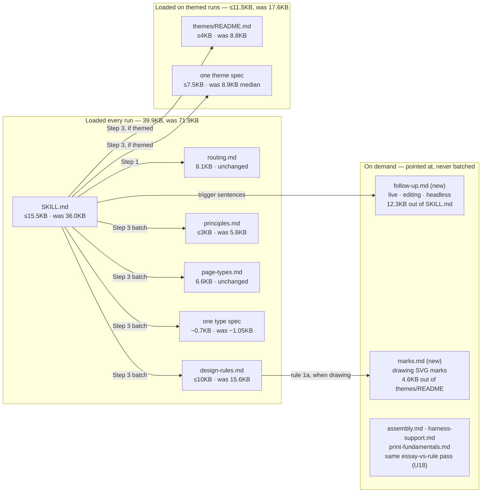

# refactor: Cut the print skill to essentials

## Summary

Cut what a themed run loads from ~90.6KB to ≤56KB by keeping what changes the
printed page or the model's next action and removing what does not. Three
classes of prose get three treatments: mechanism explanation the model never
uses is deleted; thresholds and procedures the model demonstrably executes
stay; judgment rationale — the case behind a rule — is cut last, in its own
commits, because whether it earns its place is exactly what the gate has to
find out. Nothing is protected. The server gets a dead-code survey rather than
a redesign, and the gate compares post-cut pages to pre-cut pages, not to a
control that loses on physical rules alone.

---

## Problem Frame

A themed first-generation run loads ~90.6KB of instruction before writing any
content, and that instruction rides every one of ~40-50 turns as cache-read.
Measured on the working tree at `b7d20bf`:

| file | bytes | loaded |
|---|---|---|
| `SKILL.md` | 36,004 | every run |
| `references/design-rules.md` | 15,551 | every run |
| `references/routing.md` | 8,135 | every run |
| `references/page-types.md` | 6,635 | every run |
| `references/principles.md` | 5,581 | every run |
| `references/themes/README.md` | 8,752 | every themed run |
| one theme spec | 5,504 (comic) – 9,011; median 8,877 | every themed run |
| one type spec | 1,053 median | every run |
| **total, median theme** | **90,588** | |

Plus `references/themes/theme-spec-template.md` (6,559) whenever the model
follows either of two pointers into it — the ad-hoc theme checklist, and
`SKILL.md` Step 3's `custom_css` row, which names it as the token set.

### Where the bytes go that do not earn their place

**44% of `SKILL.md` serves turns a first generation never reaches.** Live mode
(four sections, 7,895 bytes), editing an existing page (2,342) and headless
use (2,021) total 12,258. The interview (3,738) is skipped in every headless
run. That is 16,000 bytes on every first-generation turn for paths it does not
take. The 0-of-14 live-mode figure from the eval measures the harness, not
users — first-generation runs cannot exercise those paths — so this is a
loaded-per-turn argument, not a "nobody uses it" argument.

**The fill rule is stated three times.** `design-rules.md`'s invariant
(1,948 bytes), `SKILL.md` Step 3 (781) and Step 6 (667), with `principles.md`
VII restating the overflow half. One owner; the others point.

**Mechanism explanation the model never operates.** The preamble's account of
the shell's shadow root and renderer (1,186 of 1,507 bytes). Step 6's
description of how the squeeze persists a `<style id="mp-fit-squeeze">`
block. Step 5's account of what the assemble command does internally. Part B
of `design-rules.md`, which was written as a short pointer to the linter and
has grown back to 2,305 bytes re-enumerating all nine checks the linter names
when one fires.

**Duplication in `principles.md`.** Principles I (tokens) and VI (no fills,
flat shadows) restate Part A rules 2 and 1. II, III, IV, V and VII carry
authoring instruction stated nowhere else — II's "fill named typographic
roles, never freelance a font per element" included.

**A 383-byte header on 30 of 31 type specs** telling the model where the
routing table is, which it has already read. A median spec is 1,053 bytes.

**A 4,602-byte drawing tutorial on every themed run.** "Getting a mark that
reads" applies only when the page draws a pictorial subject.

### What the traces say about prose — and it is not one thing

The model ignored "batch your reads" in 14 of 14 runs until it became a
command block, and launched `server.mjs` directly 15 times against a
prohibition. But the same traces show prose followed reliably: Step 8's two
reminder sentences reproduced verbatim in 12 of 12 completed runs;
`data-mp-section` wrapping in 14 of 14; the sizing ledger executed by name
(*"Sizing ledger first (letter landscape, content box 912×680, footer takes
41 → 639 usable)"*); and the squeeze ladder's floors used in 6 of 14 runs to
decide whether to accept a squeeze or cut content — a judgment the passing
output line cannot inform, since `fit-cli` prints the applied percentage and
never the floors.

So "the model ignores prose" is false as a generalization. Three classes:

| class | example | model uses it? | treatment |
|---|---|---|---|
| mechanism explanation | shadow root; how the squeeze persists | no | delete |
| thresholds and procedures | ladder floors; ledger; section marking; report sentences | yes, traced | keep, tightened |
| judgment rationale | why a stretched page is hard to see; the case for ranking content | untested | cut last, own commits, measured |

### What this is not

A context cut, not a turn cut: removing prose the model does not act on
removes tokens from each turn, not turns. It is also not a server change —
measured, a Chromium launch is ~120ms and a full fit or contrast check ~1.8s,
so merging the two saves ~8s of a 456s run. The server gets a survey for dead
code and oversized surface, not a redesign.

---

## Requirements

**Budget** — measured directly from the files a run reads, with
`references/themes/sports.md` as the theme spec (median size).

R1. A themed first-generation run loads ≤56KB of instruction, from ~90.6KB.
R2. `SKILL.md` ≤15.5KB, from 36KB.
R3. Median per-turn context — `cache_read_input_tokens +
   cache_creation_input_tokens` per assistant message, over the turns after
   the Step 3 batched read — drops ≥30% against the same statistic from
   `2026-09-03-001-d63693b2`. Per-turn, so turn-count changes from other work
   cannot satisfy it; ≥30% because ~40% of the ~22k instruction tokens leave
   and margin is owed.

**Nothing lost that changes the page**

R4. Every rule in `design-rules.md`'s platform invariants and Part A, and
   every Part B check that has no Part A counterpart (items 2 and 7), survives
   as a statement. Verified by a rule-inventory fixture written from the
   current file before any cut.
R5. Every threshold or procedure the traces show the model executing survives
   in `SKILL.md`: the two squeeze floors, the sizing ledger's formula and
   geometry pointer, the `data-mp-section` rule, and Step 8's two reminder
   sentences verbatim.
R6. No server behaviour changes. U17 removes dead code and shrinks oversized
   surface; every existing test passes unchanged.
R7. Every follow-up path remains reachable: a trigger in `SKILL.md` names the
   situation and the file, and that file carries the full procedure. The
   state-keyed fit-record check — read the fit record at the start of any turn
   with a server up — keeps its own one-line trigger in `SKILL.md`, since no
   utterance fires it.

**Quality**

R8. Against the no-skill control: no more than 2 of 13 cross-arm pairs lost
   (baseline 1 of 13); physical violations ≤3. This is a floor, not a
   detector — a skill with every principle deleted still beats a control
   carrying 60 physical violations.
R9. Against the pre-cut skill: the post-cut skill loses no more than 7 of 13
   pairs to a snapshot of `b7d20bf`. The cut claims no quality change, so a
   coin flip is the pass. This is the comparison that can actually see craft
   loss, and it needs U19.

---

## Key Technical Decisions

KTD1. **Cut by loaded-per-turn cost.** The ~90KB loaded every run is the
   problem, not the 268KB of references. Rationale: cache-read is `turns ×
   context`; only the always-loaded set is in every turn.

KTD2. **Nothing is protected.** The owner's decision. The principles and the
   reasoning behind the rules are cut and measured, not preserved on the
   assumption they earn the quality margin.

KTD3. **One statement per rule, in one place.** The fill rule's owner is the
   `design-rules.md` invariant; `SKILL.md` points at it.

KTD4. **Three prose classes, three treatments.** Mechanism explanation the
   model never operates is deleted. Thresholds and procedures the traces show
   it executing stay. Judgment rationale is cut last, in separate commits, so
   the gate can attribute a regression to it. Rationale: the earlier framing
   — "instructions are unreliable, mechanisms are followed" — was true of two
   directives and false of four other passages in the same traces. The lens
   has to distinguish what the model uses from what it does not.

KTD5. **Follow-up material moves, it does not vanish.** One on-demand file;
   `SKILL.md` keeps the sentence that says when to read it.

KTD6. **The server gets a survey, not a redesign.** Rationale: the owner asked
   for the entire skill and said nothing is protected, so declaring the server
   out of scope on one 2% measurement was a scope cut in disguise. But the
   measured wall-clock cost is page load, not launch, so the change is dead
   code and oversized surface — `--auto-port` has no in-repo caller, the
   lint CLI's 3,321-byte usage string enters context on every `--help` — not
   check consolidation.

KTD7. **Phase A then Phase B, then the gate.** Mechanical cuts (moves,
   header strip, mechanism deletion, dedupe) land first. Rationale cuts land
   last, each unit its own commit. Rationale: if the gate fails, revert Phase
   B and run one more batch — two batches isolate "rationale vs mechanical"
   where six would otherwise be needed.

KTD8. **The gate compares pre-cut to post-cut.** Rationale: the no-skill
   control cannot see craft loss (R8's note). A second arm running a snapshot
   of the pre-cut tree can. That is harness work in the sibling repo (U19),
   and it is the only instrument that makes KTD2 a measurement rather than a
   hope.

---

## High-Level Technical Design

Themed-run total across both subgraphs: **≤56KB, was 90.6KB** (R1).

**Budget by unit.** Every "now" figure is `wc -c` on the working tree or
`awk` over headings; every target is what the described cuts reach with margin.

| unit | file | now | target | saving |
|---|---|---|---|---|
| U11 | `SKILL.md` | 36,004 | ≤15,500 | ~20,500 |
| U12 | `design-rules.md` | 15,551 | ≤10,000 | ~5,600 |
| U13 | `principles.md` | 5,581 | ≤3,000 | ~2,600 |
| U14 | `themes/README.md` | 8,752 | ≤4,000 | ~4,750 |
| U15 | one theme spec (median) | 8,877 | ≤7,500 | ~1,400 |
| U15 | one type spec (median) | 1,053 | ≤700 | ~380 |
| — | `routing.md` | 8,135 | 8,135 | 0 |
| — | `page-types.md` | 6,635 | 6,635 | 0 |
| | **themed run, median spec** | **90,588** | **≤55,470** | **~35,200** |

`theme-spec-template.md` (6,559) also stops loading at runtime — both pointers
into it are repointed at `page-types.md`'s token table (U11, U14).

---

## Implementation Units

U-IDs continue from the earlier plan in this directory (which reached U10).
Units are grouped by KTD7's phases; within a phase, order is by dependency.

### Phase A — mechanical

### U11. Cut `SKILL.md` to the first-generation path

**Goal:** `SKILL.md` carries what a first-generation run executes and pointers
to everything else. ≤15.5KB from 36KB.

**Requirements:** R1, R2, R5, R7

**Dependencies:** none

**Files:**
- `SKILL.md`
- `references/follow-up.md` (new) — live mode, editing an existing page,
  headless use, moved intact
- `server/test/skill-doc.test.mjs` (new) — a prose-fact harness in the shape
  of `server/test/cli-help.test.mjs`

**Approach:** Four moves.

*Move the follow-up material out* — 12,258 bytes to `references/follow-up.md`
as-is. Three trigger sentences stay, placed where the model will be: after
Step 8, *"If the user asks to change this page, or pastes `/print fix`, read
`references/follow-up.md` first"*; in Step 0, *"If the output is for an
automated consumer or the user asked for a PDF file, read the headless section
of `references/follow-up.md`"*; and in Step 7, since it is keyed to state
rather than to anything the user says, *"At the start of any later turn with
the server up, check the fit record — `references/follow-up.md`, 'A page that
stops fitting'."* Step 0's parenthetical listing the sections that contain
`<skill-dir>` is reworded to *"in this file and in `references/follow-up.md`"*,
keeping the `**absolute**` token `cli-help.test.mjs` asserts on.

*Compress the interview* — 3,738 to ~1,200: the skip rule in one sentence
(no `AskUserQuestion` tool means headless), the two dialogs' questions and
defaults as a list, the binding sentence. The harness-capability discussion
already lives in `references/harness-support.md`.

*Delete mechanism explanation* — the preamble's shadow-root and renderer
passage (1,186 bytes); Step 6's account of how the squeeze persists its
`<style id="mp-fit-squeeze">` block and re-derives; Step 5's account of what
assembly does internally; Step 7's Node-missing fallbacks (owned by
`harness-support.md`); Step 0's `--prefix`-over-`cd` rationale; the Workflow
section's batching paragraph, which the Step 3 command block has superseded.

*Dedupe against the references* — Step 3's "Fill the sheet" paragraph and
Step 6's fill paragraph each become one sentence pointing at the
`design-rules.md` invariant. Step 3's descriptions of what each reference
contains go. The `custom_css` row's "Token set: the section-to-token map in
`theme-spec-template.md`" is repointed at `page-types.md`'s token quick
reference, which is already in the batch.

**What stays whole, because the traces show the model executing it:** the
Step 0 `<skill-dir>` rule; the Step 1 routing instruction; the Step 3 command
block and channel table; the sizing ledger, compressed to its formula line and
geometry pointer (the model runs it by name, and `design-rules.md` points at
"SKILL.md Step 3" for it); **one sentence in Step 6 stating the two squeeze
floors** — spacing to 75%, type to 92% — and that a squeeze at either floor
means cut content and re-run, since the passing output never prints the
floors; the `data-mp-section` rule; the Step 5 command; Step 8's two reminder
sentences verbatim; every trigger sentence.

**Test scenarios** (`server/test/skill-doc.test.mjs`):
- `SKILL.md` ≤15,500 bytes.
- Every `<skill-dir>/…` path containing no further `<…>` placeholder and
  ending in `.md` or `.mjs`, in `SKILL.md` and `references/*.md`, resolves to
  an existing file.
- `/print fix` appears in `SKILL.md`.
- `references/follow-up.md` contains the headings "Live mode", "Editing an
  existing page" and "Headless".
- Each of those three is named from `SKILL.md` exactly once.
- `SKILL.md` contains "75%" and "92%" (the floors) and does not contain
  `mp-fit-squeeze` (the mechanism).
- `SKILL.md` contains, verbatim, "double-click any text to edit it" and
  "Press **Edit**".
- `SKILL.md` does not contain `theme-spec-template.md`.
- Every `(SKILL.md Step N)` or quoted-heading reference in `references/*.md`
  matches a heading or bolded lead-in still present in `SKILL.md`.

**Verification:** ≤15.5KB; the three follow-up sections exist intact in
`follow-up.md`; every pointer resolves; the floors, ledger, section-marking
rule and reminders are present; a first-generation run's Step 3 batch reads
the same files as before minus the template.

---

### U14. Move the drawing tutorial out of `themes/README.md`

**Goal:** A themed run loads the theme procedure, not a tutorial on
hand-drawing SVG. ≤4KB from 8.75KB, and the template stops loading at
runtime.

**Requirements:** R1

**Dependencies:** none

**Files:**
- `references/themes/README.md`
- `references/marks.md` (new) — "Getting a mark that reads", 4,602 bytes,
  moved intact
- `server/test/skill-doc.test.mjs` — extend

**Approach:** The tutorial moves unchanged. The ad-hoc checklist's item 3
points at it; U12 adds the pointer from design rule 1a.

The ad-hoc checklist's item 1 currently sends the model into
`theme-spec-template.md` for the section-to-token map (6,559 bytes on every
ad-hoc run). Do **not** copy the 1,351-byte map into the README — that would
put the README at ~5,500 and miss its ceiling. Point item 1 at
`page-types.md`'s token quick reference instead, which is already in every
run's batch and lists the same tokens. The template stays for humans adding a
theme; "Adding a new theme" keeps its pointer.

"Executing a matched spec" (1,743 bytes) stays whole. The six ad-hoc items are
tightened, not cut.

**Test scenarios:**
- `themes/README.md` ≤4,000 bytes.
- `references/marks.md` contains "Diagnostic features first" and "Judge every
  candidate at printed size".
- `themes/README.md` references `theme-spec-template.md` only under the
  "Adding a new theme" heading.

**Verification:** ≤4KB; the tutorial is reachable from the checklist and
(after U12) from rule 1a; an ad-hoc themed run's batch no longer includes the
template.

---

### U15. Strip the shared type-spec header; keep theme specs' constraints

**Goal:** The one spec a run loads carries only authoring instruction.

**Requirements:** R1

**Dependencies:** none (Phase A for the header strip; the §1/§7 trim is
Phase B — see approach)

**Files:**
- `references/types/*.md` — 30 of 31 carry the header; `image-block.md`
  opens differently and has no `*Functional requirements:*` marker
- `references/themes/{arcade,comic,field-guide,newspaper,sports}.md`
- `references/themes/theme-spec-template.md`
- `server/test/skill-doc.test.mjs` — extend

**Approach — Phase A:** Delete the 383-byte shared opening paragraph from the
30 type specs that carry it. Each keeps its H1 and description.

**Approach — Phase B:** Theme specs' §1 "Meta & Philosophy" (975-1,315
bytes) cuts to a two-line identity statement. §7 "Contrast evidence" is
**not** a proof to delete — it carries constraints stated nowhere else: which
accent may carry body text and which is restricted to marks or large type
(`arcade.md`: *"stays on marks and figures rather than carrying a sentence"*),
and in `sports.md` the kids'-team body-size floor. `comic.md`'s §7 has no
numeric ratios at all, so "a compact list of ratios" would be empty. §7
becomes one line per accent — token, ratio where measured, size clearance —
plus any body-floor override. Only the gamut and screen-legibility notes go.
Update the template to the leaner shape.

**Test scenarios:**
- No file in `references/types/` contains "holds the routing table".
- Every file in `references/types/` except `image-block.md` has an H1 on
  line 1 and contains `*Functional requirements:*`.
- Median type spec ≤700 bytes.
- Every theme spec keeps all seven section headings.
- §1 and §7 together ≤600 bytes in every theme spec; `comic.md` ≤4,500 total,
  every other spec ≤7,500.
- Every accent token defined in a theme's §3 appears in its §7.

**Verification:** the six assertions pass; a themed run's batch is ~1,750
bytes lighter.

---

### U17. Survey the server for dead code and oversized surface

**Goal:** The server carries no code with no caller and no surface out of
proportion to what it does. No behaviour changes.

**Requirements:** R6

**Dependencies:** none

**Files:**
- `server/server.mjs` — `--auto-port` and `autoPort`
- `server/lint-cli.mjs` — usage string, comment density
- `server/chat-cli.mjs`, `server/chat-store.mjs` — survey only
- existing tests, unchanged

**Approach:** The rate-limited audit that was meant to precede this plan never
ran; this unit is that audit, scoped to what a survey found in one read.

`server.mjs`'s `--auto-port` flag and its `attempt - port < 10` walk have no
in-repo caller since `serve-cli` picks its own port. Remove them and the doc
comment that describes a dead path.

`lint-cli.mjs` is 32KB — larger than `fit-cli` — for nine text rules. Its
`USAGE` string is 3,321 bytes and enters the model's context on every
`--help`; cut it to the flag list and one line per rule. Its `lintBlock`
function is 7,500 bytes; report whether it can be shortened without a behaviour
change, but do not restructure it here. Comment density (140 of 639 lines) is
in line with the other CLIs and is not a target.

`chat-cli.mjs` and `chat-store.mjs` (14KB) are live mode — not dead, not
loaded into context. Survey and report; change nothing.

**Test scenarios:** `Test expectation: none beyond the existing suite — every
existing test passes unchanged, which is R6's proof.` Add one assertion to
`cli-help.test.mjs`: `lint-cli --help` output ≤1,500 bytes.

**Verification:** `grep -rn auto-port server/` returns nothing; every
existing test passes; `lint-cli --help` ≤1,500 bytes.

---

### U18. Apply the same pass to the on-demand references

**Goal:** `assembly.md`, `harness-support.md` and `print-fundamentals.md`
get the essay-vs-rule pass everything else gets, judged by necessity rather
than by load frequency.

**Requirements:** R4

**Dependencies:** U11 (so pointers into these files from the cut `SKILL.md`
are settled first)

**Files:**
- `references/assembly.md` (11,779) — pointed at from four places, none on
  the first-generation path; `assemble-cli.mjs` performs everything it
  describes except hand assembly without Node
- `references/harness-support.md` (8,162) — three pointers
- `references/print-fundamentals.md` (4,625) — one pointer
- `server/test/skill-doc.test.mjs` — extend

**Approach:** Same three classes as KTD4. `assembly.md`'s description of the
assembly procedure duplicates what the command does; keep the anchors an
in-place edit needs and the hand-assembly path, drop the walkthrough of what
`assemble-cli` already does. `harness-support.md`'s three parts are each a
capability question with one answer; keep the answers. `print-fundamentals.md`
is short and mostly numbers; verify its figures against `page-types.md`'s
geometry and keep it.

These do not move R1 — they are not on the batched path — and no ceiling is
set. The test is the same one that guards everything else: every pointer into
them still resolves, and every rule they own survives in the inventory.

**Test scenarios:**
- Every heading another file points at in these three files still exists.
- The R4 inventory phrases that these files own (the `<body>` attributes and
  `@page` anchors in `assembly.md`; the loopback and image-backend rules in
  `harness-support.md`) survive.

**Verification:** pointers resolve; inventory passes; the hand-assembly path
in `assembly.md` is still complete.

---

### Phase B — rationale, each unit its own commit

### U12. Cut `design-rules.md` to one statement per rule

**Goal:** Every rule survives; the reasoning behind it mostly does not.
≤10KB from 15.5KB.

**Requirements:** R1, R4

**Dependencies:** U14 — rule 1a's new pointer targets `references/marks.md`,
which U14 creates; land after it or in the same commit so the pointer never
dangles.

**Files:**
- `references/design-rules.md`
- `server/test/skill-doc.test.mjs` — extend

**Approach:** Write the R4 inventory fixture first, from the current file.

*Platform invariants.* The fill bullet (1,948) becomes the rule's single owner
and tightens to the rule: two floors, two underfill shapes, remedies in cost
order, one pass — ~900 bytes. The containers-clip bullet (1,791) keeps the rule
(containers clip; clearance is `padding-block`, never
`overflow-clip-margin`; never zero a display heading's padding) and drops the
line-box and margin-collapse explanation — ~900.

*Part A.* Rule 1 (1,529) keeps the allowlist, the flat-shadow shape and
`.invert`/`.tint`; drops the ~500 bytes on why gradients dither and the
viewer's chrome shadow. Rule 1a keeps "pictorial marks are stroked SVG, never
CSS fills" plus one sentence pointing at `references/marks.md`. Rule 3a's
font suggestions become a four-row table. Rules 2-5 are already one statement.

*Part B* (2,305) shrinks to ~350: nine checks, run by `lint-cli.mjs` inside
assembly, never grep your own CSS, the report names each violation with its
line and fix. The enumeration goes — except that items 2 (no backslashes) and
7 (no character references in `style` attributes) have no Part A statement,
so each keeps one sentence here.

*Part C* halves.

**Test scenarios:**
- `design-rules.md` ≤10,000 bytes.
- Every phrase in the inventory fixture survives (`--color-paper`,
  `overflow-clip-margin`, `padding-block`, `font_import`,
  `data-mp-section`, `.invert`, backslash, character reference, one per
  rule).
- Headings "Platform invariants", "Part A", "Part B", "Part C", "Section
  marking" survive.
- Rule 1a names `references/marks.md`.

**Verification:** ≤10KB; inventory passes; every pointer into this file
resolves.

---

### U13. Dedupe `principles.md`

**Goal:** Keep the instructions stated nowhere else; drop their arguments.
≤3KB from 5.6KB.

**Requirements:** R1

**Dependencies:** U12

**Files:**
- `references/principles.md`
- `server/test/skill-doc.test.mjs` — extend

**Approach:** I (named tokens) and VI (design for the medium) restate Part A
rules 2 and 1; each becomes one line pointing there. II keeps its instruction
— hierarchy through type alone, named typographic roles, never a per-element
font — and drops only its decoration sentence, which rule 1 owns. III (rank
multi-item content), IV (design the empty state first), V (typographic
correctness) and VII (count the content before choosing a layout) keep their
instruction and lose their argument. The premise paragraph goes.

This is the unit KTD2 bites hardest: these are the plausible source of pages
that read as composed. The instructions stay. The case for them is what the
gate measures.

**Test scenarios:**
- `principles.md` ≤3,000 bytes.
- Headings I-VII survive — theme specs cite them by number.
- "lead", "empty state", curly-quote characters, "count", and "typographic
  roles" survive.

**Verification:** ≤3KB; seven headings; five instructions present.

---

### Phase C — measure

### U19. Give the eval a pre-cut arm

**Goal:** The gate can see craft loss.

**Target repo:** `print-skill-eval`

**Requirements:** R9

**Dependencies:** none (harness work; can proceed in parallel with Phases A
and B)

**Files:**
- `eval.config.json`, `src/config.mjs`, `src/runner.mjs` — per-arm
  `skillSource`
- `src/trace-metrics.mjs`, `test/trace-metrics.test.mjs` — the metrics script
  from the earlier plan's U6, which was never built; add the per-turn context
  metric R3 needs

**Approach:** Today both arms are `{skill: true}` and `{skill: false}` with
one global `skillSource`. A second skill arm needs a per-arm source so one can
point at a snapshot of `b7d20bf` and the other at the post-cut tree. The
gallery already presents pairs blind; two skill arms produce skill-vs-skill
pairs the same way. Keep the no-skill arm as the physical-violation tripwire
(R8) in a three-arm batch, or run it as a separate cheaper batch — decide by
what the pairing code supports.

The metrics script pins: per-turn context as
`cache_read_input_tokens + cache_creation_input_tokens` per assistant message
after the Step 3 read; median as the midpoint of an even sample; assemble
outcomes classified from `tool_result` text.

**Test scenarios:**
- A config with two skill arms and distinct sources runs each cell against
  the right tree — assert by a marker file present in one snapshot and not
  the other.
- The per-turn context metric on the `d63693b2` traces reproduces a pinned
  fixture figure.
- The metrics script classifies `Cannot find module`, `does not fit` and
  `structural verification FAILED` results as non-passes.

**Verification:** a dry run enumerates cells for both skill arms; the metric
tests pass.

---

### U16. Gate

**Goal:** One batch answers whether the cut removed context without moving
pages.

**Target repo:** `print-skill-eval`

**Requirements:** R1, R2, R3, R8, R9

**Dependencies:** U11-U15, U17, U18, U19

**Approach:** `--task-set wide --replicates 1`, pre-cut arm at `b7d20bf`,
post-cut arm at the branch head, no-skill arm as tripwire. Read R3 per-turn
so Tier 1's turn reduction cannot satisfy it. Read R9 first — it is the only
number that can see the thing KTD2 risks. Read turn count for information:
this plan removes prose the model does not act on, so turns should not move;
if they do, something the model used was cut, and the class table in the
Problem Frame says where to look.

If R9 fails: revert Phase B (U12's rationale paragraphs, U13, U15's §1/§7),
one more batch. If it still fails, the mechanical cuts are implicated and the
inventory fixture is the next place to look.

**Test scenarios:** `Test expectation: none — this unit runs the harness U19
builds.`

**Verification:** always-loaded bytes ≤56KB from the files the post-cut run
read; `SKILL.md` ≤15.5KB; per-turn context down ≥30%; post-cut loses ≤7 of 13
to pre-cut; ≤2 of 13 to control; physical violations ≤3; `git diff --stat`
against `b7d20bf` touches nothing under `server/` except U17's changes and
the new test file.

---

## Scope Boundaries

**In scope:** everything a run can load — the always-loaded set, the on-demand
references, one theme and one type spec — plus dead code and oversized
surface in the server, plus the harness change that makes the gate honest.

### Deferred to Follow-Up Work

- **Combining fit and contrast into one browser session.** ~8s of a 456s run.
- **Consolidating the 31 type specs.** Only one loads per run; the
  maintenance case may still justify it.
- **The ~7 pure-text turns after the last assemble.** U11 compresses Step 8;
  the gate's turn count will say whether that moved anything.
- **`chat-cli.mjs`'s 4949 default and the registry hardening residuals** from
  the earlier plan.
- **`lintBlock` restructuring** if U17's survey finds it can shrink without a
  behaviour change.

**Not in scope:** any check's behaviour, what the skill produces, and the
print-correctness rules themselves.

---

## Risks

**The rationale cut degrades pages.** KTD2 accepted this; KTD7 and KTD8 make
it visible and attributable. If R9 fails, Phase B reverts first, in one
batch. If R9 fails and Phase B was not the cause, R4's inventory is the next
suspect — a rule lost in compression rather than rationale lost by design.

**A threshold or procedure the model uses is cut as "explanation."** The
traces already caught one — the squeeze floors — before this plan shipped.
R5 pins the four that were found; there may be others. U11's implementer
should grep the traces for any `SKILL.md` phrase they are about to delete.

**The pre-cut arm is real harness work.** U19 is in a sibling repo and touches
config, runner and pairing. If it slips, the gate falls back to R8 alone and
the plan must say so rather than pretend R8 measured craft.

**The gate's baseline is stale for turns and total tokens.** Tier 1 and
main's fill fix sit between `d63693b2` and this batch. R3 is per-turn for
that reason; total cache-read and turn count are read for information only.

**Follow-up paths are unexercised by the gate.** First-generation batches
cannot reach them. R7's triggers are asserted to exist, not to fire.

---

## Sources

- Working tree at `b7d20bf`, measured with `wc -c` and `awk` over headings:
  `SKILL.md` (preamble 1,507, shadow-root passage 1,186, follow-up sections
  12,258, interview 3,738, Step 3 fill 781, Step 6 fill 667, scope notes
  953); `references/design-rules.md` (fill bullet 1,948, clip bullet 1,791,
  rule 1 1,529, Part B 2,305); `references/themes/README.md` (mark tutorial
  4,602); `references/themes/theme-spec-template.md` (token map 1,351);
  theme specs 5,504 / 8,825 / 8,877 / 8,939 / 9,011; type header 383, median
  spec 1,053.
- `server/browser.mjs`, `fit-cli.mjs`, `contrast-cli.mjs` — launch ~120ms,
  fit 1,804ms, contrast 1,701ms on this machine. `server.mjs` `--auto-port`
  has no caller outside itself. `lint-cli.mjs` `USAGE` is 3,321 bytes.
- Eval traces `2026-09-03-001-d63693b2` — squeeze floors used in 6 of 14
  runs; Step 8 reminders verbatim 12 of 12; `data-mp-section` 14 of 14; the
  sizing ledger by name; batching ignored 14 of 14; `server.mjs` launched
  directly 15 times. `report.txt` — 13 of 14 pairs judged, 92%, control 60
  physical violations vs skill 3. Seventeen later result directories share
  the config hash and have no report; none is a usable baseline.
- `docs/plans/2026-09-03-001-perf-print-skill-token-efficiency-plan.md` —
  the prior plan; its U6 metrics specification is absorbed into U19.
